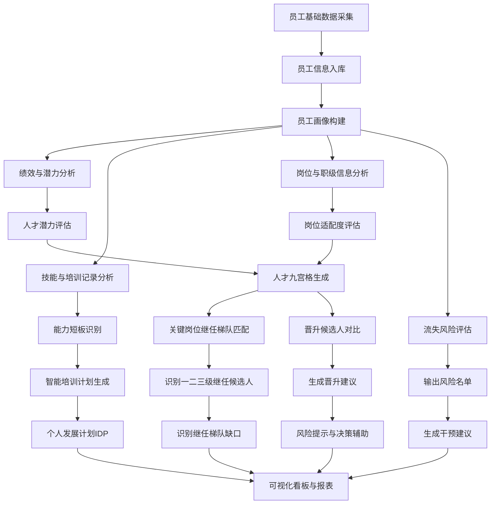
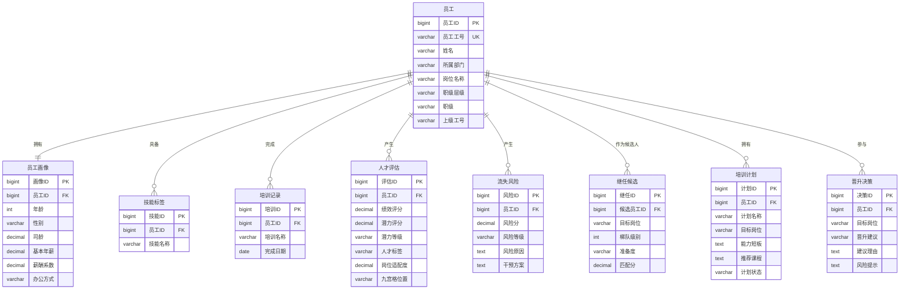

主要业务流程图：展示平台从员工数据采集到人才评估、继任梯队、风险预警、培训规划和晋升决策的完整业务闭环。

```mermaid
flowchart TD
    A[员工基础数据采集] --> B[员工信息入库]
    B --> C[员工画像构建]

    C --> D[绩效与潜力分析]
    C --> E[技能与培训记录分析]
    C --> F[岗位与职级信息分析]

    D --> G[人才潜力评估]
    F --> H[岗位适配度评估]
    G --> I[人才九宫格生成]
    H --> I

    I --> J[关键岗位继任梯队匹配]
    J --> K[识别一二三级继任候选人]
    K --> L[识别继任梯队缺口]

    C --> M[流失风险评估]
    M --> N[输出风险名单]
    N --> O[生成干预建议]

    E --> P[能力短板识别]
    P --> Q[智能培训计划生成]
    Q --> R[个人发展计划IDP]

    I --> S[晋升候选人对比]
    S --> T[生成晋升建议]
    T --> U[风险提示与决策辅助]

    L --> V[可视化看板与报表]
    O --> V
    R --> V
    U --> V
```

功能结构图：展示系统按照业务能力划分的功能模块。

```mermaid
flowchart TD
    A[智能企业人才梯队建设平台]

    A --> B[员工数据管理]
    B --> B1[员工基础信息管理]
    B --> B2[岗位与职级管理]
    B --> B3[技能标签管理]
    B --> B4[培训记录管理]

    A --> C[人才潜力评估]
    C --> C1[绩效评分分析]
    C --> C2[潜力评分分析]
    C --> C3[岗位适配度计算]
    C --> C4[人才九宫格生成]

    A --> D[继任梯队管理]
    D --> D1[关键岗位识别]
    D --> D2[一级继任候选人匹配]
    D --> D3[二级继任候选人匹配]
    D --> D4[三级继任候选人匹配]
    D --> D5[梯队缺口分析]

    A --> E[流失风险预警]
    E --> E1[流失风险评分]
    E --> E2[风险等级划分]
    E --> E3[风险员工名单]
    E --> E4[干预方案建议]

    A --> F[智能培训规划]
    F --> F1[能力短板分析]
    F --> F2[课程资源匹配]
    F --> F3[个人发展计划IDP]
    F --> F4[培训计划跟踪]

    A --> G[晋升决策辅助]
    G --> G1[候选人横向对比]
    G --> G2[晋升建议生成]
    G --> G3[晋升风险提示]
    G --> G4[决策记录管理]

    A --> H[数据可视化分析]
    H --> H1[人才结构看板]
    H --> H2[九宫格分布图]
    H --> H3[继任梯队看板]
    H --> H4[流失风险报表]
    H --> H5[培训与晋升报表]
```

数据关系图：展示系统核心数据实体及其主外键关系。

```mermaid
erDiagram
    员工 ||--|| 员工画像 : 拥有
    员工 ||--o{ 技能标签 : 具备
    员工 ||--o{ 培训记录 : 完成
    员工 ||--o{ 人才评估 : 产生
    员工 ||--o{ 流失风险 : 产生
    员工 ||--o{ 继任候选 : 作为候选人
    员工 ||--o{ 培训计划 : 拥有
    员工 ||--o{ 晋升决策 : 参与

    员工 {
        bigint 员工ID PK
        varchar 员工工号 UK
        varchar 姓名
        varchar 所属部门
        varchar 岗位名称
        varchar 职级层级
        varchar 职级
        varchar 上级工号
    }

    员工画像 {
        bigint 画像ID PK
        bigint 员工ID FK
        int 年龄
        varchar 性别
        decimal 司龄
        decimal 基本年薪
        decimal 薪酬系数
        varchar 办公方式
    }

    技能标签 {
        bigint 技能ID PK
        bigint 员工ID FK
        varchar 技能名称
    }

    培训记录 {
        bigint 培训ID PK
        bigint 员工ID FK
        varchar 培训名称
        date 完成日期
    }

    人才评估 {
        bigint 评估ID PK
        bigint 员工ID FK
        decimal 绩效评分
        decimal 潜力评分
        varchar 潜力等级
        varchar 人才标签
        decimal 岗位适配度
        varchar 九宫格位置
    }

    流失风险 {
        bigint 风险ID PK
        bigint 员工ID FK
        decimal 风险分
        varchar 风险等级
        text 风险原因
        text 干预方案
    }

    继任候选 {
        bigint 继任ID PK
        bigint 候选员工ID FK
        varchar 目标岗位
        int 梯队级别
        varchar 准备度
        decimal 匹配分
    }

    培训计划 {
        bigint 计划ID PK
        bigint 员工ID FK
        varchar 计划名称
        varchar 目标岗位
        text 能力短板
        text 推荐课程
        varchar 计划状态
    }

    晋升决策 {
        bigint 决策ID PK
        bigint 员工ID FK
        varchar 目标岗位
        varchar 晋升建议
        text 建议理由
        text 风险提示
    }
```